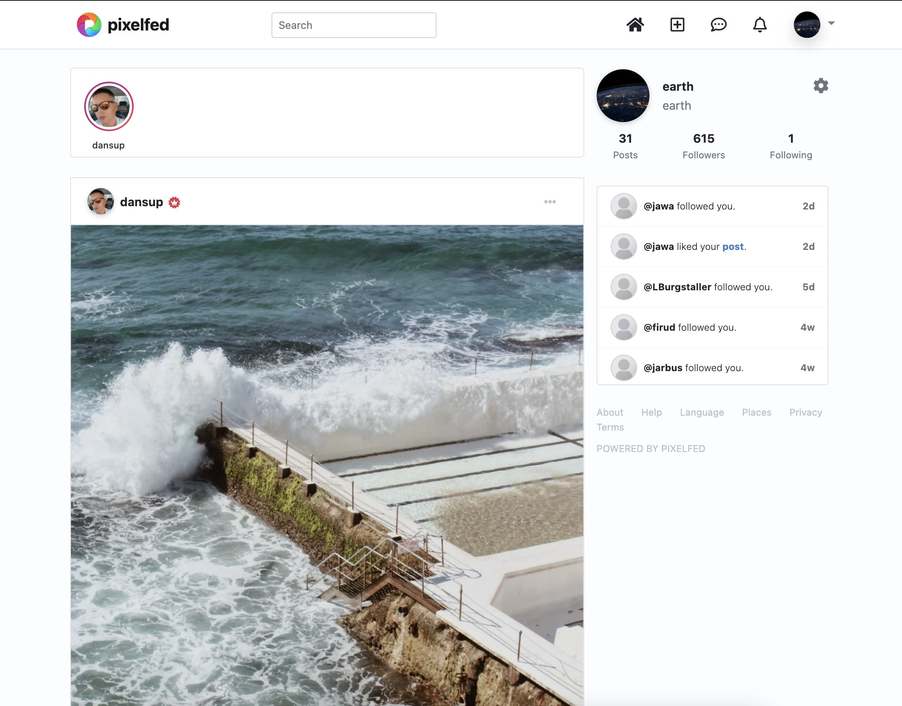

<!--
NOTA: Este README foi creado automáticamente por <https://github.com/YunoHost/apps/tree/master/tools/readme_generator>
NON debe editarse manualmente.
-->

# Pixelfed para YunoHost

[](https://dash.yunohost.org/appci/app/pixelfed)  

[](https://install-app.yunohost.org/?app=pixelfed)

*[Le este README en outros idiomas.](./ALL_README.md)*

> *Este paquete permíteche instalar Pixelfed de xeito rápido e doado nun servidor YunoHost.*  
> *Se non usas YunoHost, le a [documentación](https://yunohost.org/install) para saber como instalalo.*

## Vista xeral

PixelFed is a decentralized and federated image sharing software under development.
In addition to taking over the functionality of Instagram, the functioning of PixelFed is:

* Decentralized: Each instance can follow one or more other PixelFed instances in order to allow their respective members to interact. A first pixelfed.social public body limited to 10,000 members has already been created.

* Federated: Via the ActivityPub protocol, PixelFed can interact with other software that is part of the Fediverse, such as Mastodon or PeerTube for example.

It is also possible to import your data from Instagram. 

**Versión proporcionada:** 0.11.13~ynh1

## Capturas de pantalla



## Avisos / información importante

## Some useful commands to know to manage your instance
You need to run them from you pixelfed folder (usually `/var/www/pixelfed`). The `php.VERSION` might be changed according to you current package version.

### Applying changes from the `.env` config file

Once you made some changes, you need to run `php8.2 artisan config:cache && php8.2 artisan cache:clear` to apply them.
Note: this will disconnect any logged-in account (including from the admin web UI).

### Removing avatar cache to save space
`php8.2 artisan avatar:storage-deep-clean`

Use it to prune old avatars that are outdated or no longer used. This might save some disk space.

### Fix missing avatars or refetch them.
`php8.2 artisan  avatar:storage`

It can be used to fetch remote avatars that are not loaded (or in case you deleted `/var/www/pixelfed/storage/app/public/cache/avatars` where they are stored).
It might also be usefull to migrate that cache (only, not the other existing media) to an S3 storage, by refectching all of them.

Be aware that this will generate a lot of "jobs" that will take time to be completed, and have a significant load on your server (especially bandwith and CPU).

### When using S3

- Delete non-used media that where not cleaned (it happens) : `php8.2 artisanmedia:gc` (Delete media uploads not attached to any active statuses)

- Same but for media stored on S3 storage and still locally stored (doubles) : `php8.2 artisan media:s3gc` (Delete (local) media uploads that exist on S3)

- Migrate your media to an S3 storage (you need to configure it first), so media uploaded before configuring S3 are migrated there: `php8.2 artisanmedia:migrate2cloud` (Move older media to cloud storage)

- Migrate from one S3 backend the other one (change the configuration first): `php8.2 artisanmedia:cloud-url-rewrite` (Rewrite S3 media urls from local users)

## Documentación e recursos

- Web oficial da app: <https://pixelfed.org/>
- Documentación oficial para usuarias: <https://docs.pixelfed.org/>
- Documentación oficial para admin: <https://docs.pixelfed.org/running-pixelfed/administration.html>
- Repositorio de orixe do código: <https://github.com/pixelfed/pixelfed>
- Tenda YunoHost: <https://apps.yunohost.org/app/pixelfed>
- Informar dun problema: <https://github.com/YunoHost-Apps/pixelfed_ynh/issues>

## Info de desenvolvemento

Envía a túa colaboración á [rama `testing`](https://github.com/YunoHost-Apps/pixelfed_ynh/tree/testing).

Para probar a rama `testing`, procede deste xeito:

```bash
sudo yunohost app install https://github.com/YunoHost-Apps/pixelfed_ynh/tree/testing --debug
ou
sudo yunohost app upgrade pixelfed -u https://github.com/YunoHost-Apps/pixelfed_ynh/tree/testing --debug
```

**Máis info sobre o empaquetado da app:** <https://yunohost.org/packaging_apps>
